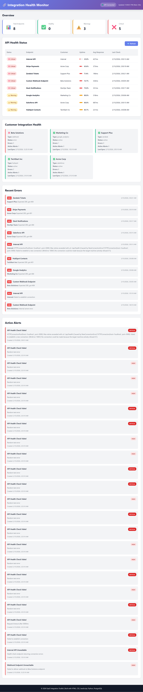
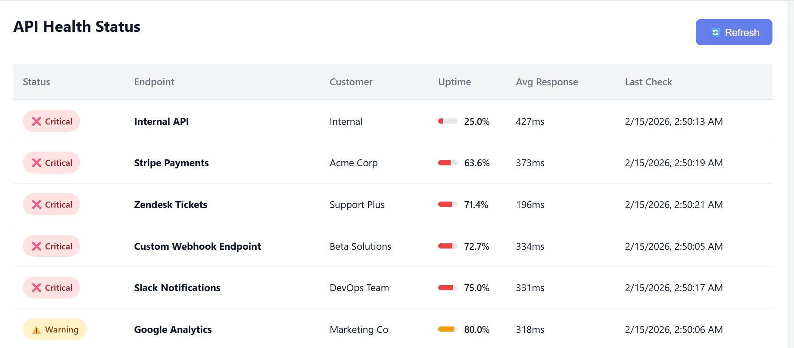
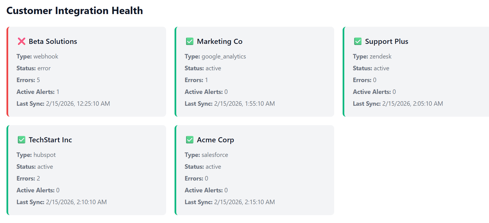

# SaaS Integration Health Toolkit

A full-stack monitoring and debugging toolkit for SaaS platform integrations, demonstrating Customer Success Solutions Consultant capabilities.

## 🎯 Overview

This project simulates real-world scenarios faced by Customer Success Solutions Consultants when helping customers integrate, troubleshoot, and maintain SaaS platform connections. It showcases technical problem-solving, API debugging, database management, and customer-facing interface development.

## ✨ Key Features

- **🔍 API Health Monitoring** - Real-time tracking of endpoint uptime, response times, and error rates
- **📊 PostgreSQL Analytics** - Complex SQL queries with views, joins, CTEs, and window functions
- **🌐 REST API Backend** - Python Flask API with 8+ endpoints for integration data
- **💻 Responsive Dashboard** - Clean, mobile-friendly interface built with vanilla JavaScript
- **🎣 Webhook Debugger** - Node.js service for receiving, validating, and analyzing webhooks
- **📝 Log Analyzer** - Python script for parsing server logs and detecting error patterns
- **🚨 Alert System** - Automatic issue detection with severity-based alerting

## 🛠️ Tech Stack

### Backend
- **Python 3.8+** - Flask REST API, monitoring scripts, log analysis
- **Node.js 14+** - Express.js webhook listener service
- **PostgreSQL 14+** - Relational database with complex queries

### Frontend
- **HTML5** - Semantic structure
- **CSS3** - Responsive design with CSS Grid/Flexbox
- **Vanilla JavaScript** - ES6+, Fetch API, no frameworks

### Tools & Libraries
- **Flask** - Python web framework
- **Express.js** - Node.js web framework
- **psycopg2** - PostgreSQL adapter for Python
- **pg** - PostgreSQL client for Node.js
- **Git** - Version control

## 🎓 Skills Demonstrated

### Technical Skills

**Front-End Development:**
- ✅ Vanilla JavaScript (ES6+, async/await, Fetch API)
- ✅ HTML5 semantic structure
- ✅ CSS3 responsive design (Grid, Flexbox)
- ✅ Browser DevTools debugging
- ✅ Mobile-first responsive design

**Backend Development:**
- ✅ Python Flask REST API development
- ✅ Node.js Express server implementation
- ✅ RESTful API design principles
- ✅ Error handling and logging
- ✅ Configuration management

**Database Management:**
- ✅ PostgreSQL schema design with normalization
- ✅ Complex SQL queries (JOINs, CTEs, window functions)
- ✅ Database views and materialized views
- ✅ Indexes for performance optimization
- ✅ Triggers and stored functions

**API & Integration:**
- ✅ REST API integration
- ✅ Webhook handling and validation
- ✅ API debugging with Postman
- ✅ CORS configuration
- ✅ Request/response logging

**DevOps & Tools:**
- ✅ Git version control
- ✅ Environment variable management
- ✅ Command-line proficiency
- ✅ Multi-service orchestration

### Customer Success Skills

- ✅ Integration troubleshooting methodology
- ✅ Customer-facing dashboard development
- ✅ Technical documentation writing
- ✅ Proactive issue detection
- ✅ SLA monitoring and reporting

## 📖 Documentation

- **[API Documentation](docs/API.md)** - Complete API endpoint reference
- **[Setup Guide](docs/SETUP.md)** - Detailed installation instructions
- **[Database Schema](database/schema.sql)** - Table definitions and relationships

## 📸 Screenshots

### Dashboard Overview

### API Health Table

### Customer Status Cards

### Mobile Responsive

## 🎯 Use Cases

This toolkit demonstrates solutions for common Customer Success scenarios:

1. **Integration Onboarding** - Monitor new customer integrations during setup phase
2. **Proactive Support** - Identify issues before customers report them
3. **SLA Management** - Track and report on service level agreements
4. **Debugging Assistance** - Webhook payload inspection for troubleshooting
5. **Customer Reporting** - Generate health metrics for business reviews

## 📄 License

MIT License - See LICENSE file for details

## 👤 About

Built as a portfolio project to demonstrate technical capabilities for Customer Success Solutions Consultant roles, particularly for SaaS platforms requiring technical customer onboarding, integration troubleshooting, and platform configuration expertise.

**Author:** Prashanth Matangi  
**Email:** prashanth.matangi5@gmail.com    
**LinkedIn:** https://linkedin.com/in/prashanth-matangi  
**Location:** Hyderabad, India
**Built with:** Python, JavaScript, Node.js, PostgreSQL, HTML, CSS

*This is a demonstration project with simulated data. All customer names and scenarios are fictional.*

